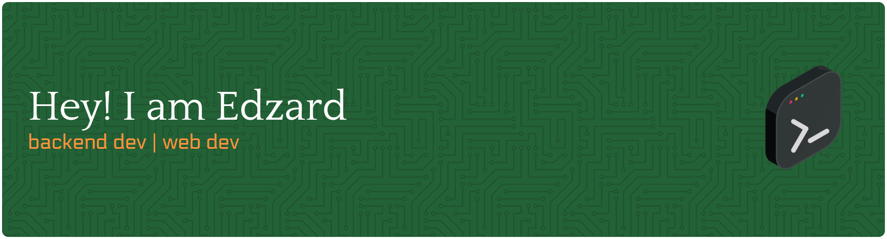

# 💫 About Me:

   

## MY Skill     

## Have studied    

## 🌐 Socials:

   

## onther

<picture>
  <source media="(prefers-color-scheme: dark)" srcset="https://raw.githubusercontent.com/Edzard9/Edzard9/output/pacman-contribution-graph-dark.svg">
  <source media="(prefers-color-scheme: light)" srcset="https://raw.githubusercontent.com/Edzard9/Edzard9/output/pacman-contribution-graph.svg">
  
</picture>

  

<!-- Proudly created with GPRM ( https://gprm.itsvg.in ) -->
